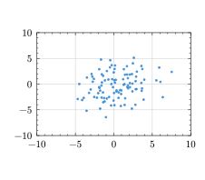
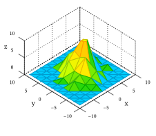
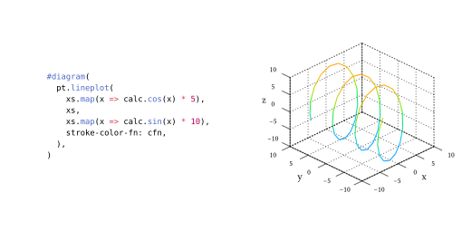
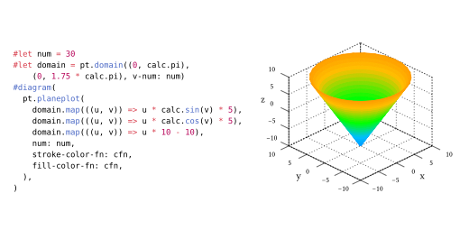
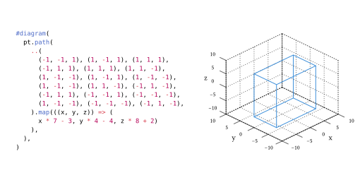
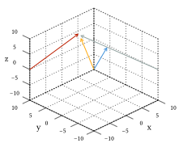
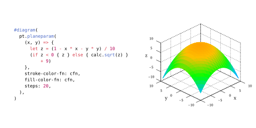
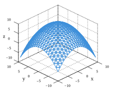
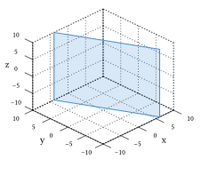

# pt3d

A dependency-free 3d plotting library written in pure typst, inspired by [lilaq](https://lilaq.org/).

Examples can be found in ./examples.

## showcase

### histogram

### plotted line

### plotted plane

### path

### vector

### parametrized plane

### plane

### line

## albums that helped create this project

<iframe style="border: 0; width: 100%; height: 42px;" src="https://bandcamp.com/EmbeddedPlayer/album=4235461950/size=small/bgcol=ffffff/linkcol=0687f5/transparent=true/" seamless><a href="https://oiboys.bandcamp.com/album/oi-boys">Oi Boys by Oi Boys</a></iframe>
<iframe style="border: 0; width: 100%; height: 42px;" src="https://bandcamp.com/EmbeddedPlayer/album=11641305/size=small/bgcol=ffffff/linkcol=0687f5/transparent=true/" seamless><a href="https://krasseville.bandcamp.com/album/summer-songs">Summer songs by Krasseville</a></iframe>
<iframe style="border: 0; width: 100%; height: 42px;" src="https://bandcamp.com/EmbeddedPlayer/album=415509987/size=small/bgcol=ffffff/linkcol=0687f5/transparent=true/" seamless><a href="https://sensualworld.bandcamp.com/album/feeling-wild">Feeling Wild by Sensual World</a></iframe>
<iframe style="border: 0; width: 100%; height: 42px;" src="https://bandcamp.com/EmbeddedPlayer/album=3561326973/size=small/bgcol=ffffff/linkcol=0687f5/transparent=true/" seamless><a href="https://crimeofpassing.bandcamp.com/album/crime-of-passing">Crime of Passing by Crime of Passing</a></iframe>
